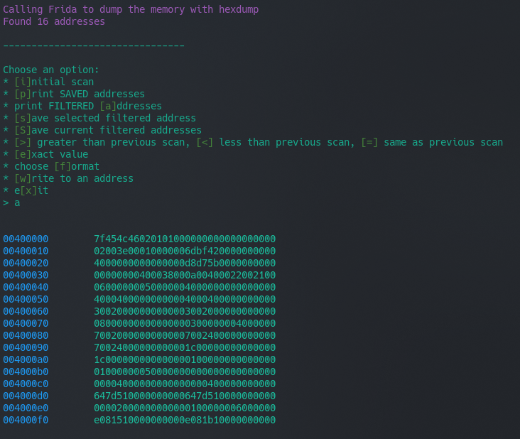

# memsearch

A CLI program to read and write program memory, built on Frida

## Instructions

1. Install [Frida](https://frida.re/) and [Python](https://www.python.org/downloads/)
2. Download this program with `git clone https://github.com/mostlyfireproof/memsearch.git`
3. Navigate to the folder with `cd memsearch/src`
4. Run the program with `python3 userinterface.py [path to program]`, which will attach this to the target
5. Once in the program, you can choose several operations:
    * `i` will dump and store all the current memory
    * `p` and `a` print out saved and filtered addresses
    * `s` saves a selected address with a comment, and `S` saves all the currently filtered addresses with a comment
    * `>`, `<`, and `=` can be used to filter addresses based on how the memory is changed
    * `e` searches for an exact value, with a format specified with `f`
    * `w` writes a value to an address, allowing live memory editing

# Writeup

## Goals

The initial goal of this project was to create a cheat program for a single game,
but I expanded the scope to target any program.
I decided on creating something similar to Cheat Engine,
but built on Frida so it can run on any operating system and target mobile programs as well.
I switched to developing on Linux partially through my work, so this design decision made it a lot easier.
Also, this program will be fully open source so developers can contribute or change up my program.

## How Does It Work?

memsearch launches the specified program and instantly attaches Frida to it. 
It runs a script with RPC to first get the program info, such as its name and location in memory,
then uses this RPC to its full advantage by utilizing it to call a function to dump the memory.

The main Python program then takes this memory, 
and stores it in a class with the address, current value, and initial value.
The user can then filter down this memory to find a specific address, such as health, gold, 
or number of items in a stack.

*todo: add a video showing this here*

Internally, memsearch makes heavy use of dictionaries to store the memory in a key:value pair 
with the address as a key and the class with the data as a value.

## Results

Currently, the program only gets the initial memory.

I tested it on the game Terraria to change the player's health, and (insert another game here)

*todo: finish the program and writeup*

## Future Plans

* Save annotated memory addresses to a file to make it easier to analyze a program repeatedly
  * Users will also be able to share these to other users analyzing the same program
* Store the memory history
* Add an easy interface to hook functions
* Lock the value of an address

## Related Work

[Cheat Engine](https://cheatengine.org/)

[memdig](https://github.com/skeeto/memdig), a similar program written in C

